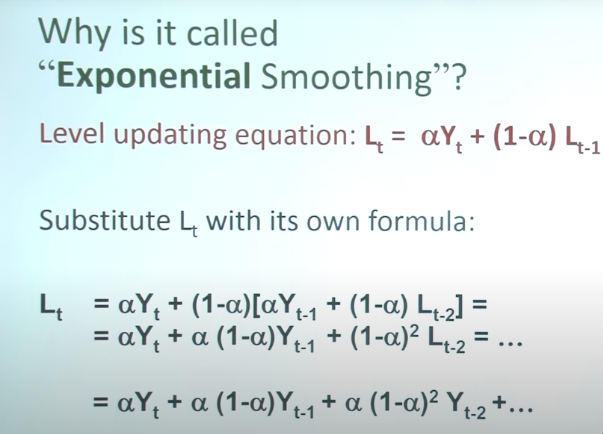

The model cleverly combines the classic Exponential Smoothing model (ES) and a Recurrent Neural Network (RNN)

- The ES decomposes the time series in level, trend and seasonality components.
- The RNN is trained with all the series, has shared parameters and it is used to learn common local trends among the series while the ES parameters are specific for each time series.

## what is forecasting?

## Exponential Smoothing model (ES)

The idea behind Simple Exponential Smoothing is to forecast future values by using a weighted average of all the previous values in our series. We can use this for forecasting a series that doesn't have trend and doesn't have seasonality.

The larger the value of the theta, the more the most recent observation is emphasized. The quicker the observation decay happens.
Smoothing constant

#### Simple exponential smoothing (SES)

- https://www.youtube.com/watch?v=i7Pyf1z_8XE

#### Concept behind ES

- https://www.youtube.com/watch?v=Fqge2HDH2Co

# level update equation

In this equation we're taking the level at time t and updating the previous level at time,t minus 1 by integrating information from our most recent data point, Yt.

You can see that it's a weighted average where we have alpha and 1 minus alpha as our weights.

Alpha is called the smoothing constant and it's a number somewhere between 0 and 1.

We can see that weights decrease exponentially into the past,

## smoothing constant

# RNN

RNN have weights biases, layer and activation functions, The big difference is RNN has feedback loops.
Although RNN may look like it only take single input value. The feedback loop makes it possible to use sequential input values, like stock market price collected over time, to make prediction

